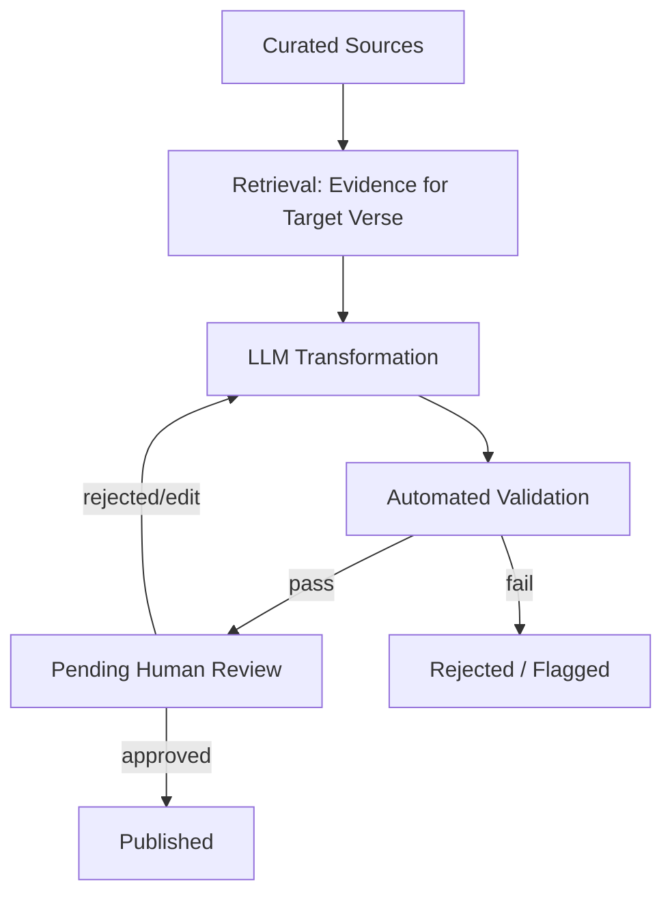
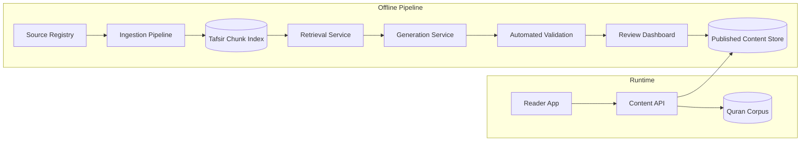

# Tadbor — RAG Architecture (Part 1: Core Design)

*Covers sections 1–20 of the requested scope at implementation-ready depth. Part 2 (evaluation framework, infrastructure/cost detail, ADRs, scaling playbook, security/observability specifics, risks & open questions — sections 21–35) follows as a separate document so this one stays focused on the decisions that are hardest to reverse later.*

## 1. Executive Summary

Tadbor is not a generic RAG chatbot — it's a **grounded religious-content verification pipeline** where an LLM is one controlled transformation stage among several, never the source of religious meaning. The architecture's job is to make three things true simultaneously: every generated explanation is traceable to an approved source, the Quran text can never be altered or paraphrased in place, and nothing reaches a user without passing a human review gate. Retrieval quality matters less here than *retrieval correctness* — returning evidence for the exact requested verse, from an approved source, or refusing to generate at all.

## 2. Architectural Principles

1. **Separation of content types is structural, not cosmetic.** Quran text, Tafsir, translation, simplified explanation, and dialect adaptation are distinct entities in the database and distinct fields in the API — never merged into one blob the LLM can blur.
2. **Evidence-only generation.** The LLM only transforms evidence it was given; it is never asked an open question like "explain verse X."
3. **Fail closed, not open.** Insufficient evidence → no generation, not a best-effort guess.
4. **Pre-generation over on-demand generation.** Given the review gate, content should be generated and reviewed once, then served statically — not regenerated per user request (detailed in §29 of Part 2, but it shapes every design choice below).
5. **Small MVP, additive scaling.** One surah's worth of real usage should validate the pipeline before any part of it is generalized to 114 surahs.

## 3. Religious Content Safety Model

This is the model every other section implements. The pipeline has a strict shape:



**LLM is permitted to:** simplify an existing approved interpretation, translate it, adapt it to a dialect, summarize retrieved evidence for a reviewer, organize/format content.

**LLM is never permitted to:** originate a Tafsir position, invent asbab al-nuzul or historical context, resolve scholarly disagreement on its own authority, treat its own output as fact absent a human sign-off, or touch the Quran text field.

The enforcement of this isn't a prompt instruction alone — it's structural: the LLM's input is *always* a specific evidence set plus a specific transformation instruction ("simplify this," "translate this," "render this in Egyptian Arabic"), never the raw ayah with an open-ended request.

## 4. High-Level Architecture



The key structural decision: **the reader app never touches retrieval or generation at runtime.** It only reads from the published content store and the immutable Quran corpus. Generation happens offline, ahead of time, gated by review. This eliminates an entire class of risk (a user triggering live, unreviewed generation) and is discussed further in Part 2 §29.

## 5. Quran Corpus Architecture

The Quran corpus is a separate, protected store — not part of the Tafsir/retrieval index.

- **Source:** a single trusted digital Mushaf source (Uthmani script), chosen once and treated as immutable going forward. (Which specific source to adopt is a product/religious decision, not a technical one — flagged as an open decision in Part 2.)
- **Representation:** one record per Ayah — `surah_id`, `ayah_number`, `text_uthmani`, `text_simple` (a normalized form for search only, never displayed as "the Quran"), a content hash for integrity checking, and a `corpus_version`.
- **Versioning:** the corpus is versioned as a whole (e.g., "Quran Corpus v1.0"); no per-ayah edits are ever made outside a full, reviewed corpus revision — and in practice this should almost never change once validated.
- **Embedding decision: do not embed Quran text for semantic retrieval.** Verse lookup is always exact (surah+ayah, or an exact-match search against `text_simple`), never "find the ayah that seems similar to this query." Semantic ambiguity is exactly what must never happen when identifying *which verse* is being discussed. Lexical/exact indexing (a simple database index or hash lookup) is sufficient and safer than vector similarity here.
- **Integrity check:** on every deploy, the corpus's content hash is validated against a known-good hash before the app serves any content — Quran text corruption should be a hard deploy-blocking failure, not a runtime concern.

## 6. Curated Tafsir Corpus & Source Registry

Tadbor deliberately does not do open-ended ingestion. The Source Registry is the gate for what can ever become evidence.

**Source Registry entity:**
```
Source {
  id, title, author, language,
  edition/publication_version,
  methodology_classification,   // e.g., narration-based, opinion-based, linguistic — descriptive, not a ranking
  authority_tier,                // Tier 1 / 2 / 3, set by human reviewers, not by the system
  licensing_status,              // public domain / licensed / pending rights clearance
  ingestion_status,               // not_started / in_progress / ingested
  verification_status,            // unverified / verified_by:<reviewer_id>
  metadata (free-form)
}
```

**Trust tiers** (assigned by qualified human reviewers, never inferred automatically):
- **Tier 1 — primary grounding:** the small set of sources approved as the default evidence for generation.
- **Tier 2 — secondary/cross-reference:** used to corroborate or surface alternate views, not as sole grounding for a first-pass explanation.
- **Tier 3 — reference only:** background material a reviewer may consult but that never feeds the LLM directly.

A source cannot be used in generation until `licensing_status` is cleared and `verification_status` is set by a reviewer — this is enforced at the query layer (retrieval simply excludes any source not in that state), not just as a policy.

**Non-technical concerns this registry must track:** copyright/public-domain status, digitization rights, edition provenance (which print edition was digitized, since editions can differ), and known OCR-quality issues per source — these become fields, not afterthoughts.

## 7. Ingestion Pipeline

```
Raw Source → Acquisition → Validation → OCR/Parsing (if needed) → Cleaning →
Arabic Normalization → Structure Detection → Verse Mapping → Chunking →
Metadata Enrichment → Embedding → Indexing → Quality Validation → Available for Retrieval
```

Notes specific to Arabic Tafsir text, where generic pipelines usually go wrong:

- **Normalization must be reversible/auditable.** Store the original cleaned text alongside any normalized form used for search (e.g., diacritic-stripped for lexical matching) — never discard the original in favor of the normalized version.
- **Diacritics are meaning-bearing in Quranic quotations embedded within Tafsir** — a Tafsir author quoting an ayah must preserve full diacritics even if the surrounding commentary text is normalized differently.
- **OCR errors are a validation gate, not a cleanup step to apply silently.** Any OCR-sourced document needs a human spot-check before entering the index; automated "confidence scores" from OCR tools are a triage signal, not a pass/fail.
- **Footnotes, page numbers, and headings are structure, not noise** — they carry information about which verse a passage discusses and should be parsed into metadata (§9), not stripped.
- **Edition differences are tracked at the source-version level** (§6), so two editions of the same Tafsir are two distinct, separately-verified `Source` records, not silently merged.

## 8. Verse-Level Mapping

This is the single most important correctness property in the whole system, and it's modeled explicitly rather than inferred from embeddings.

```
ChunkAyahMapping {
  chunk_id,
  surah_id,
  ayah_start,
  ayah_end,          // equal to ayah_start for single-verse commentary
  mapping_type        // single_ayah | multi_ayah | surah_level | thematic
}
```

A single Tafsir chunk can map to a range (e.g., 12:4–6); a chunk can also be `surah_level` (an introduction) or `thematic` (cross-cutting, not tied to a specific ayah). Retrieval for "explain 12:4" queries this mapping table directly — it is a metadata filter, not a similarity search — and only falls back to broader ranges/thematic content if no exact single-ayah mapping exists from an approved source. This ordering (exact → range → thematic → none) is a hard preference order in the retrieval service, not a scoring heuristic the reranker might override.

## 9. Chunking Strategy

**Recommendation: hierarchical, verse-anchored chunking — not fixed-size token windows.**

```
Surah → Ayah → Tafsir Section (per the mapping above) → Paragraph
```

Reasoning: fixed-size chunking risks splitting a single verse's commentary across chunk boundaries or merging commentary on adjacent-but-distinct verses into one chunk, which directly undermines §8. Instead, chunk boundaries follow the Tafsir's own structure (verse-commentary sections, then paragraphs within a long section if it exceeds a practical size for the LLM context window). Each chunk retains a `parent_chunk_id` so a paragraph-level chunk can be expanded back to its full verse-commentary section when a reviewer or the context-assembly step (§12) needs more surrounding context.

## 10. Metadata Model

**Mandatory on every chunk:** `source_id`, `source_version`, `surah_id`, `ayah_start`, `ayah_end`, `mapping_type`, `language`, `content_type` (tafsir / historical_context / lexical / thematic), `authority_tier`, `review_status` of the source it came from.

**Optional/contextual:** `page`, `chapter`, `contains_scholarly_disagreement` (boolean flag a reviewer can set to force the "present multiple views" path in §13), `confidence_notes`.

The mandatory set exists because retrieval filtering (§8, §11) depends on all of them being present — a chunk missing `surah_id`/`ayah_start` simply cannot be safely retrieved and should fail ingestion validation rather than enter the index with nulls.

## 11. Hybrid Retrieval Architecture

**Recommended sequence:**
```
Request (surah, ayah, target language/dialect)
  → Metadata filter (approved sources only, correct authority tier, matching ayah mapping)
  → Lexical/exact retrieval (exact verse mapping — see §8, this is the primary signal)
  → Vector retrieval (semantic similarity, secondary signal — for thematic/cross-reference candidates only)
  → Candidate fusion
  → Reranker (cross-encoder, to order candidates by actual relevance to the specific verse and query intent)
  → Evidence selection (top-k, capped, favoring exact-mapped chunks over semantic-only matches)
```

**Trade-off reasoning, not just a components list:**
- **BM25/lexical retrieval is primary, not a fallback,** because verse identification must be exact — this is the opposite of a typical RAG setup where vector search leads. Given §8's explicit mapping table, most requests don't need semantic search at all; a direct metadata + exact-mapping query answers them. Vector search earns its place for thematic queries ("what does the Quran say about patience") where no single verse mapping exists.
- **A cross-encoder reranker is worth the latency cost** here specifically because generation is offline/pre-computed (§4), not live per-user-request — so reranking cost is paid once per verse/style combination, not per reader.
- **Skip a dedicated vector database for MVP.** Given the corpus size (one surah, a handful of sources) and offline generation, `pgvector` inside the same Postgres instance as everything else is sufficient — see Part 2 §23 for when a dedicated vector DB would actually earn its complexity (multi-thousand-source, multi-hundred-thousand-chunk scale, or a need for very low-latency live semantic search, neither of which applies here).
- **No knowledge graph for MVP.** It would model relationships (thematic links, cross-references) that aren't needed until the "thematic commentary across many surahs" feature is built — premature for one surah.

## 12. Retrieval Guardrails

- **Verse mismatch prevention:** the exact-mapping lexical result for the requested ayah must be present in the final evidence set whenever one exists from an approved source; a semantically-similar-but-different-verse chunk can supplement but never substitute for it.
- **Source filtering is enforced at the query layer:** the retrieval query itself excludes any source not marked `verification_status: verified` and cleared for licensing — this can't be bypassed by prompt design later.
- **Evidence threshold / insufficient evidence:** if metadata + exact mapping return zero chunks for a requested verse from any approved Tier 1/2 source, the system returns `INSUFFICIENT_EVIDENCE` and stops — no generation attempt, no fallback to "the model probably knows this." This state routes to a human task ("source this verse") rather than a user-facing answer. Calibrating *how much* evidence is "sufficient" (one chunk vs. requiring corroboration) is a policy decision reviewers should own explicitly per content type, not a number invented in code.

## 13. Context Assembly

Assembled context for the LLM contains, in this order: target verse reference (surah:ayah, for the prompt's framing only — never the Quran text itself as something to be transformed), the selected evidence chunks (capped, e.g., top 3–5 post-rerank, to avoid dilution), each chunk's source citation metadata, the target output language/dialect, the target explanation level (Beginner/Tadabbur/Advanced), and the fixed system-level safety instructions (§14).

To prevent contamination: only chunks that passed retrieval guardrails (§12) enter the context — nothing is ever appended from a source outside the approved registry, even for "just for context." If two selected chunks come from sources with `contains_scholarly_disagreement` implications, both are retained and passed through *without* letting the LLM silently pick one (§14, §13-conflict-handling below).

## 14. Source Conflicts

When Tier 1/2 sources genuinely disagree on a verse's meaning, the system does not merge them into one confident statement. Two handling paths:

1. **Present both views**, attributed ("According to [Source A]... A related view from [Source B]...") — only when both sources are independently retrieved as evidence for that exact verse.
2. **Escalate to human review as a specific case type** when the disagreement is substantial enough that a simplified single explanation would misrepresent the range of scholarly opinion — this determination is made by the reviewer, not inferred by the LLM.

The generation contract (§15) requires the LLM to preserve disagreement markers found in the evidence rather than resolve them — this is enforced by validation (§18) checking that if evidence contained a disagreement flag, the output must reflect more than one position or be routed for review instead of published.

## 15. LLM Generation Layer — Contract

The LLM is invoked with a specific transformation task (simplify / translate / adapt-dialect), never an open question, and must return structured output:

```json
{
  "content": "the generated explanation text",
  "source_refs": ["chunk_id", "..."],
  "claims": ["short factual claims made, for validation against evidence"],
  "warnings": ["e.g., 'evidence reflects scholarly disagreement'"],
  "confidence": "high | medium | low",
  "requires_review": true
}
```

`requires_review` is always `true` by contract — there is no code path where it can be `false`; it exists in the schema to make the review gate explicit and auditable, not to be toggled.

System-level instructions enforced on every call: generate only from provided evidence; do not invent Tafsir, Hadith, historical context, or asbab al-nuzul; do not resolve disagreement present in the evidence; do not alter or reproduce Quran text as if generating it; explicitly flag uncertainty rather than smoothing it over; every substantive claim must map to a `source_ref`.

## 16. Translation Architecture

Translation is modeled as three distinct operations, not one:

- **Translation of Quran meaning** — out of scope for LLM generation entirely in the sense that it's not dynamically generated; if Tadbor ever shows a "meaning translation" of the ayah itself, it should be sourced from an existing vetted translation (its own Tier 1 source), not produced by the LLM, since translating the Quran itself is a distinct and highly sensitive scholarly act.
- **Translation of Tafsir** — LLM-assisted, always operating on an already-reviewed interpretation, always re-reviewed after translation for fidelity (not just fluency).
- **Translation/localization of the simplified explanation** — same pattern: translate the approved simplified text, re-review.

Guardrail against meaning drift: the translation prompt includes the source-language approved text as the only substantive input, with an explicit instruction not to add examples, softenings, or clarifications not present in the source — fluency improvements are fine, content additions are not, and this is exactly what the reviewer's translation-fidelity check (§18) is checking for.

## 17. Dialect Adaptation

Modeled explicitly as a presentation-layer transformation over an already-approved meaning, not a new interpretation:

```
Verified Meaning (reviewed, canonical)
   → Dialect Adaptation (e.g., Egyptian Arabic)
   → Validation: does it preserve subject, certainty, modality, negation, conditions?
   → Review (scoped: reviewer checks dialect fidelity, not re-checks the underlying meaning)
```

Because the underlying meaning was already reviewed, the dialect reviewer's job is narrower and faster: confirm the dialect rendering didn't change what's being asserted (a change in *certainty* — "it is said that..." becoming a flat assertion — is the most common failure mode worth explicitly checking for). Testing approach: a checklist-based review rather than automated semantic-similarity scoring, since subtle modality/certainty shifts are exactly what automated similarity metrics tend to miss.

## 18. Citation System

```
Generated Claim → Evidence Chunk(s) (source_refs from §15) → Tafsir Source → Edition/Version → Ayah/Page/Section
```

Every published explanation carries its `source_refs` forward into the user-facing citation display — this is not reconstructed after the fact from the source registry; it's stored as part of the published content record so a later source-registry change can't silently alter what a citation claims. Users see, at minimum, the source title and author; a "view details" affordance can expose edition and section for anyone who wants to check further.

## 19. Automated Validation (Pre-Review)

Deterministic checks (no LLM involved) run before anything reaches a human reviewer:
- Quran text integrity — exact-match against the canonical corpus for any verse reference used in framing.
- Citation coverage — every `claims` entry in the structured output must map to at least one `source_ref`.
- Source validation — every `source_ref` must resolve to a source with `verification_status: verified`.
- Verse mapping validation — the referenced verse must match the request (catches a generation-layer mix-up).
- Language/dialect validation — output is actually in the requested target language/dialect (a lightweight language-ID check).

LLM-assisted checks (used as a second pass, not a substitute for the above): flagging content that appears to introduce a named entity, date, or event not present in the evidence chunks — a heuristic hallucination detector that surfaces items for the human reviewer's attention rather than auto-rejecting, since it will have false positives.

## 20. Human Review Workflow

```
Generated → Automated Validation → Pending Review → Reviewer decision → Published
```

Reviewer actions: **Approve** (as-is), **Edit & Approve** (reviewer corrects then approves — edited text still goes through automated validation before publish), **Reject** (sent back with a reason, re-enters generation), **Escalate** (for source-conflict or scope questions beyond this reviewer's mandate).

Every review record stores: reviewer identity, decision, timestamp, `source_version` and `prompt_version` in effect at review time, and free-text comments. Critically: **if the underlying source version changes after approval, the previously-approved explanation is automatically invalidated for continued publication** and must be re-reviewed — this prevents a silently-stale explanation from persisting after its grounding source was corrected or updated.

---

*Part 2 will cover: Evaluation Framework (§21), Prompt Injection Defense detail (§22 — the core principle is already stated in §3/§13: ingested documents are data, never instructions, and this applies even to Tier 1 sources), Database schema detail (§24/§26), API Boundaries (§25), Infrastructure & cost (§23/§29), Security/Observability (§27/§28), MVP recommendation with diagrams (§30), Scaling Strategy (§31), ADRs (§32), Risks & Open Questions (§33/§34), and Recommended Implementation Order (§35).*
